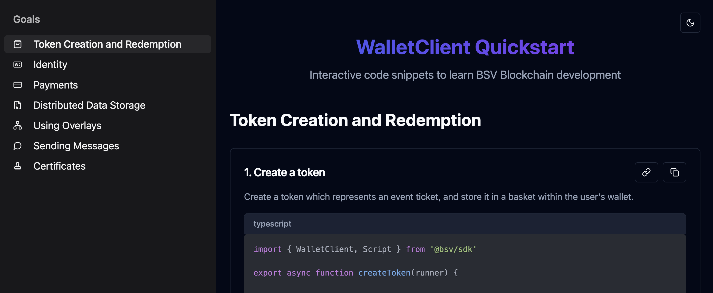
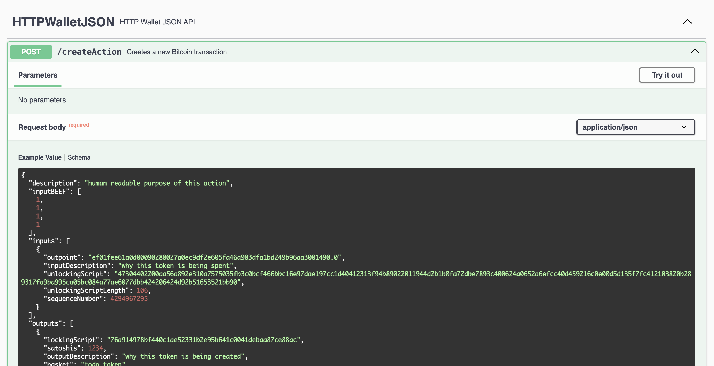

# BSV TypeScript SDK Documentation

## SDK Overview

The BSV TypeScript SDK is designed to provide an updated and unified layer for developing scalable applications on the BSV Blockchain. It addresses the limitations of previous tools by offering a Direct Instant Payments (DIP) approach, ensuring privacy and scalability.

## Installation

To install the SDK, run:

```bash
npm install @bsv/sdk
```

You can then import modules from the SDK as follows:

```ts
import { WalletClient, PrivateKey, Transaction } from "@bsv/sdk";
```

Or using require syntax:

```js
const { WalletClient, PrivateKey, Transaction } = require("@bsv/sdk");
```


## BRC-100 Application to Wallet Interface

This interface is what most application developers will use to interact with the BSV blockchain.

🚀 **[WalletClient Quickstart](https://fast.brc.dev/)**

- Run SDK code examples without any setup
- Experiment with transactions, keys, and scripts in real-time  
- Learn by doing with immediate feedback
- Test concepts from our tutorials interactively

[](https://fast.brc.dev/)

Perfect for getting started quickly or experimenting with new ideas.

Another way to familiarize yourself with the Application to Wallet Interface is to checkout this Swagger UI.

[](./swagger/index.html)

Finally, you can deep dive into the details of the interface and types in the reference material below.

## Reference Material

- [Wallet](./reference/wallet.md)
- [Primitives](./reference/primitives.md)
- [Script](./reference/script.md)
- [Transaction](./reference/transaction.md)
- [Mutual Authenitcation](./reference/auth.md)
- [Identity](./reference/identity.md)
- [Overlay Tools](./reference/overlay-tools.md)
- [Registry](./reference/registry.md)
- [Storage](./reference/storage.md)
- [KV Store](./reference/kvstore.md)
- [Messages](./reference/messages.md)
- [TOTP](./reference/totp.md)
- [Compatibility](./reference/compat.md)


## Coming Soon™

- [Manual Transaction Creation](#manual-transaction-creation)
- [Broadcasting Transactions](#broadcasting-transactions)
- [Deriving Keys](#deriving-keys)
- [Overlays](#overlays)
- [MessageBox](#message-box)


## Performance Reports

- [Benchmarks](./performance.md)